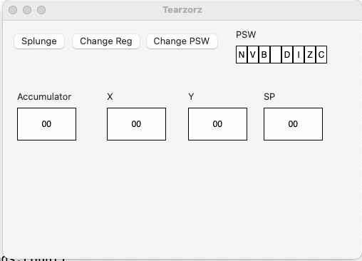
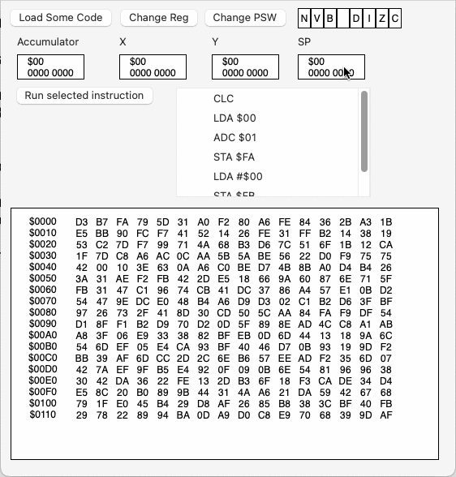
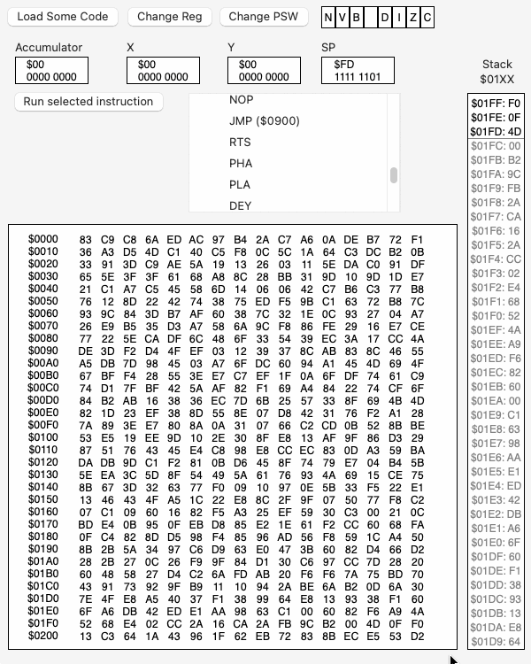

# Tearzorz

Some 6502 exploration, maybe a tool to assist in the "tearing" method of reverse engineering introduced by Don Lancaster in his "Enhancing your Apple II" books. Or maybe I'll get distracted and not do much.  Or maybe I'll accidentally write a non-cycle-accurate emulator.  Anything can happen.

# Porgress

Can update registers and change the proces status word, and see views
react.

Can now click on the flags in the PSW to toggle them. Starts adding some
instruction executing.  Shows memory and highlights bytes that change.

Shows the stack (page 1). Adds stack instructions 

# LICENSE

This uses the "[AI0 Attribution Non Commercial No Derivatives License](https://www.humanscommons.org/license/ai0-by-nc-nd/1.0)". The big thing is the AI0 part - specifically _"The licensor wishes to allow every person to freely copy, distribute, display, perform, and transform the licensed material, provided that such use is carried out entirely by a Human and not by any AI-driven or automated system."_ - Humans only.  It's a license violation to glom this stuff into an LLM.  If you would like to compensate me for glomming this stuff into an LLM, feel free to contact me.

